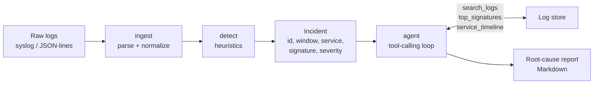

# logroot-agent

[](https://github.com/bolongpa/logroot-agent/actions/workflows/ci.yml)
[](LICENSE)
[](pyproject.toml)

An LLM agent that triages log anomalies and writes root-cause analyses —
the boring, high-leverage part of being on-call, automated.

**The problem.** Production incidents start as log noise: an error rate that
creeps up, a latency percentile that drifts, a brand-new exception nobody has
seen before. On-call engineers page through thousands of lines, correlate
across services by hand, and write the same "probable cause" summary every
time. Threshold alerts tell you *something* is wrong; they don't tell you
*why*.

**The approach.** logroot splits the job the way a good on-call pair would:

1. **Deterministic detectors** (no LLM, no cost, no hallucinations) scan the
   log stream and flag *incidents*: error bursts, brand-new error signatures,
   latency spikes.
2. **An LLM agent** takes one incident, gathers evidence with read-only tools
   (`search_logs`, `top_signatures`, `service_timeline`), correlates across
   services, and writes a structured root-cause report: summary, evidence
   timeline, likely cause with confidence, remediations.



## Quickstart

```bash
pip install -e .
logroot demo          # end-to-end: synthetic logs -> detect -> agent -> report
```

`logroot demo` generates 30 minutes of logs from a fake microservice
landscape (`api-gateway`, `etl-worker`, `db-proxy`), injects a downstream
database slowdown, detects the resulting incidents, and has the agent
investigate the headline one. It runs **fully offline** — the default
`--llm fake` backend is a deterministic scripted stand-in, so the demo is
reproducible and needs no API key.

Analyze your own log file:

```bash
logroot analyze /var/log/myapp.log            # offline, scripted reasoning
logroot analyze /var/log/myapp.log --llm openai  # real LLM via OpenAI-compatible API
```

For `--llm openai`, set `LLM_BASE_URL`, `LLM_API_KEY`, and optionally
`LLM_MODEL` (any OpenAI-compatible chat-completions endpoint works —
OpenAI, Azure, vLLM, Ollama, …).

Supported log formats: syslog-ish (`2026-09-26T21:00:01Z ERROR etl-worker …`)
and JSON-lines (`{"timestamp": …, "level": …, "service": …, "msg": …}`).
Malformed lines are skipped, never fatal.

## Example output

Real output of `logroot demo` (incident: DB slowdown injected at 21:20 UTC):

```
Detected 8 incident(s):
  - [high] latency_spike api-gateway: p95 latency 30355ms in window (vs typical history)
  - [high] latency_spike db-proxy: p95 latency 12381ms in window (vs typical history)
  - [high] latency_spike etl-worker: p95 latency 30970ms in window (vs typical history)
  - [medium] error_burst etl-worker: 12 errors in a 5-min sliding window (typical ~0.0 per window)
  ...

Analyzing error_burst-etl-worker-20260926T212002-169f34 with llm=fake ...
```

```markdown
# Root-cause analysis — `error_burst-etl-worker-20260926T212002-169f34`

**Service:** `etl-worker` · **Severity:** medium · **Kind:** `error_burst`
**Window:** 2026-09-26T21:20:02+00:00 → 2026-09-26T21:25:02+00:00

## Summary

etl-worker showed anomalous behavior (error burst) in window
2026-09-26T21:20:02+00:00..2026-09-26T21:25:02+00:00:
db query timeout after 30000ms job_id=job-<n> stage=load duration_ms=<n>

## Evidence timeline

- 12x [etl-worker] db query timeout after 30000ms job_id=job-<n> stage=load duration_ms=<n>
- 6x [db-proxy] query timeout after 30000ms table=events duration_ms=<n>
- 5x [api-gateway] post /v1/extract <n> duration_ms=<n> req_id=<n> upstream=etl-worker
- 21:20 errors=2 total=3 p95=30819ms
- 21:21 errors=2 total=2 p95=30970ms
- 21:22 errors=2 total=2 p95=30545ms

## Likely root cause

The evidence points to a downstream database slowdown: db-proxy shows
elevated query latencies and timeouts in the same window, and the
etl-worker errors are dominated by 'db query timeout' signatures that
began only after the latency spike. Likely cascade:
slow DB -> db-proxy timeouts -> etl-worker job failures -> api-gateway 502s.

_Confidence: 78%_

## Suggested remediations

1. Add timeout budgets / circuit breaking between etl-worker and its slow
   dependency so one slow downstream cannot cascade.
2. Investigate the slow dependency (slow-query log, DB CPU/IO, connection
   pool saturation) and fail over or scale it.
3. Add alerting on p95 query latency, not just error rate, to catch
   degradation before it becomes an outage.
4. Retry transient downstream timeouts with exponential backoff + jitter,
   with a bounded retry budget.
```

Note the key move: the detector flagged **etl-worker**, but the agent
correlated across services and blamed the **downstream database** — the
part that actually needs fixing.

## How the agent loop works

`logroot/agent.py` — `analyze_incident(incident, llm, events, max_steps=6)`:

1. The incident is serialized into the first user message
   (`service`, `signature`, `severity`, `window`, …).
2. The LLM responds with either **tool calls** or a **final report**.
3. Tool calls execute against an in-memory log store (read-only by design —
   the agent can never mutate anything) and results are fed back.
4. The loop repeats until the LLM emits the final report or the step budget
   runs out (in which case you get an honest low-confidence report, not a
   crash).

The final report is a strict JSON object — `summary`, `evidence_timeline`,
`root_cause`, `confidence`, `remediations` — parsed into a
`RootCauseReport` dataclass and rendered to Markdown by `report.py`.

The system prompt instructs the model to correlate across services and to
**never invent services, hosts, or metrics** not present in tool output.

### LLM backends

`LLMClient` is a small protocol: `chat(messages, tools) -> {"content", "tool_calls"}`.

- **`FakeLLM`** — deterministic and offline. It follows a sensible
  investigation script (`top_signatures` → `service_timeline` →
  `search_logs`) and writes the report from the evidence using small,
  transparent heuristics. Used by the test suite and the default demo so
  everything is reproducible without an API key.
- **`OpenAICompatibleLLM`** — talks to any OpenAI-compatible
  `/chat/completions` endpoint via `requests`. Tools are passed as native
  function-calling schemas.

## Project structure

```
logroot-agent/
├── logroot/
│   ├── __init__.py    # public API
│   ├── ingest.py      # parse syslog-ish / JSON-lines -> LogEvent (tolerant)
│   ├── detect.py      # heuristic detectors -> Incident list
│   ├── simulate.py    # synthetic microservice logs + incident injection
│   ├── agent.py       # tool-calling loop, LLMClient, FakeLLM, OpenAI backend
│   ├── report.py      # RootCauseReport -> Markdown
│   └── cli.py         # `logroot demo` / `logroot analyze`
├── tests/             # pytest: ingest, detection, agent loop (all offline)
├── .github/workflows/ci.yml
├── requirements.txt / requirements-dev.txt
└── pyproject.toml
```

## Design decisions

**Why heuristics + LLM, not LLM-only?** Detection is a counting problem:
cheap, exact, and auditable with plain code. LLMs are comparatively
expensive, slow, and non-deterministic — bad properties for something that
runs on every log line. The hybrid uses each side for what it's good at:
heuristics find *where to look*, the LLM figures out *what it means*.
This is also why the detector output is a first-class `Incident` object
the agent must ground its claims in, rather than free-form text.

**Why read-only tools?** An investigating agent should be physically
incapable of making things worse. The tool set exposes only queries over
an immutable event list.

**Why a fake LLM?** Two reasons: tests that don't depend on network or
API keys, and a demo anyone can run in seconds. The `FakeLLM` is
deliberately *scripted*, not *smart* — it demonstrates the loop mechanics
and the report contract, and its heuristics are documented in the code
rather than hidden behind a model.

**Signature normalization.** Error signatures replace numbers, UUIDs,
IPs, and hex tokens with placeholders so `job-0007` and `job-0042`
failures count as one signature. Without this, "new error signature"
detection drowns in cardinality.

## Roadmap

- [ ] Live tailing mode: stream logs, emit incidents as they fire
- [ ] Trace/request-ID correlation across services (`req_id=` is already logged)
- [ ] More detectors: log-volume anomalies, deploy-correlation (did errors start right after a deploy marker?)
- [ ] Output sinks: Slack/PD-friendly summaries, JSON report export
- [ ] Eval harness: labeled incident corpus measuring detection precision/recall and report quality

## Evaluation status

Example outputs in this README come from the deterministic offline demo (`FakeLLM`) on synthetic logs — they demonstrate the detection and investigation mechanics, not real-incident performance. No detection precision/recall numbers are claimed; an eval harness on a labeled incident corpus is on the Roadmap.

## Citation

If you use this project in academic or technical work, please cite it as:

```bibtex
@software{pan2026logrootagent,
  author = {Bolong Pan},
  title = {logroot-agent: LLM agent for log anomaly detection and root-cause analysis},
  year = {2026},
  url = {https://github.com/bolongpa/logroot-agent}
}
```

A Zenodo DOI will be added here once minted.

## License

MIT — see [LICENSE](LICENSE).
